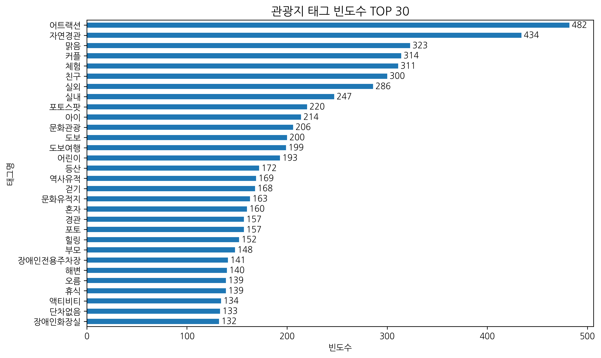
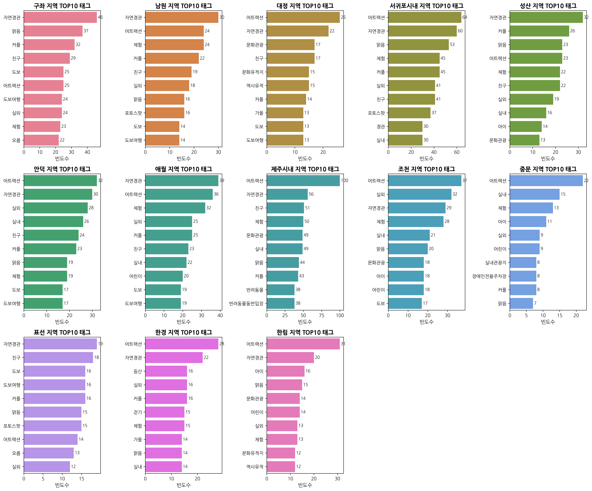
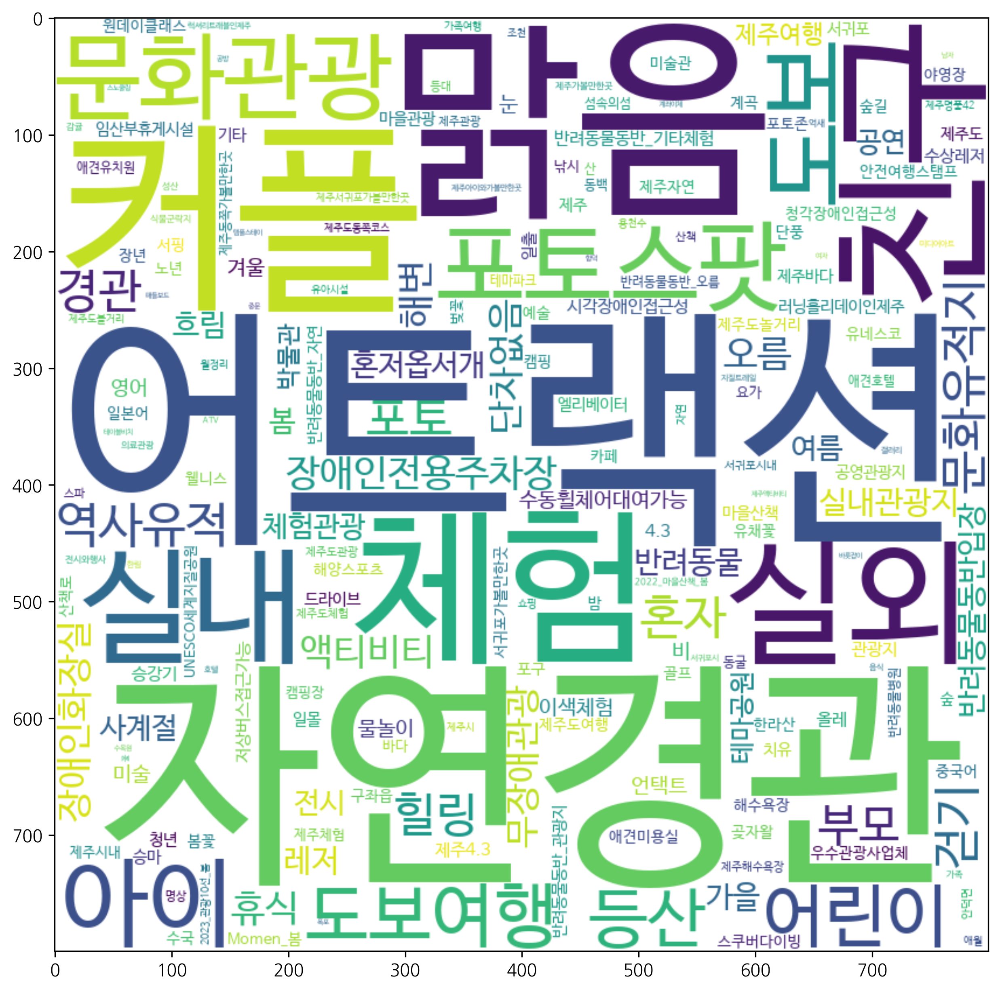
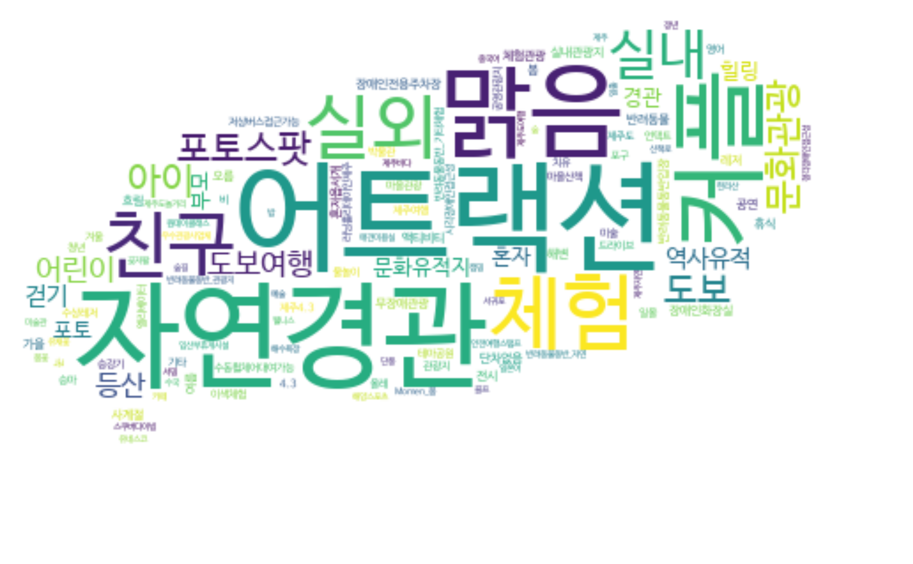

# 🏝️ Miri-Jeju Data Analysis
> **Miri 제주** 는 여행 중 발생할 수 있는 사고와 위험을 **‘미리’ 예측**하여,  
> **안전한 여행을 돕는 데이터 기반 웹 서비스** 프로젝트 입니다.   
> 프로젝트 중 제가 담당한 **데이터 수집 및 분석 파트**를 정리했습니다.

---

## 📌 프로젝트 개요
- **프로젝트명:** Miri-Jeju (안전한 제주 여행을 위한 데이터 기반 웹 서비스)  
- **진행기간:** 2025.09 ~ 2025.10  
- **팀 구성:** 총 5명 (데이터 분석 2명, PM/풀스택 1명, 챗봇 1명, 기획/QA 1명)  
- **담당 역할:** 제주 관광 데이터 수집, 정제, EDA 및 키워드 기반 분석

---

## 📊 담당 역할

### 1️⃣ 데이터 수집 (VisitJeju Open API)
- `src/0_비짓제주_관광지_API_호출_public.py`  
  → 제주 관광지(category=c1) 데이터 **약 1,300건** 수집  
  → `.txt` 파일로 원본 저장 후 CSV 변환

### 2️⃣ 데이터 전처리
- 불필요 컬럼 제거 및 중복/결측값 처리  
- 태그(`tag`) 데이터 전처리 (문자열 분리·정규화)
- 분석 목적과 관련성 낮은 태그(`tag`) 제거

### 3️⃣ 탐색적 데이터 분석 (EDA)
- 관광지 태그 빈도수 분석 → **제주 전체 TOP 30 태그, 제주 지역별 TOP 10 도출**  
- **워드클라우드**를 통한 주요 키워드 시각화  
- 태그 빈도수를 통한 제주 지역별 관광 특성 파악  

### 4️⃣ 텍스트 기반 키워드 분석 (TF-IDF)
- TF-IDF 분석을 이용해 제주 지역별 대표 키워드 도출  

- 분석 결과 상위 3개 태그를 조합하여 **지역별 관광 테마 설정**  
- 추출된 테마 데이터를 Miri 제주 DB에 적재해 **챗봇 답변 로직에 활용**

  

---

## 📂 Repository Structure

miri-jeju-project/                      
 ├── src/               # VisitJeju API 호출 코드             
 ├── data/              # 정제된 관광지 데이터 (CSV)              
 ├── analysis/          # Jupyter Notebook (EDA, TF-IDF 분석)              
 ├── images/            # 시각화 결과물 (워드클라우드, 바차트 등)                   
 └── README.md                 

---

## 🖼️ Visualization

### 🔠 제주 전체 관광지 태그 빈도수 TOP 30

### 🔠 지역별 관광지 태그 빈도수 TOP 10

### ☁️ 제주 전체 관광지 태그 워드클라우드

---

## 🛠️ 사용 기술
- **Python**: Pandas, WordCloud, Matplotlib, Scikit-learn(TF-IDF)
- **API**: VisitJeju Open API  
- **EDA 도구**: Jupyter Notebook

---

## 📄 참고
> 본 프로젝트는 대경ICT산업협회에서 주관한 AI 부트캠프 프로젝트 결과물입니다.                  
>  **‘Miri 제주’ 프로젝트**의 일부로  **데이터 수집 및 분석 파트만을 포함**합니다.                 

